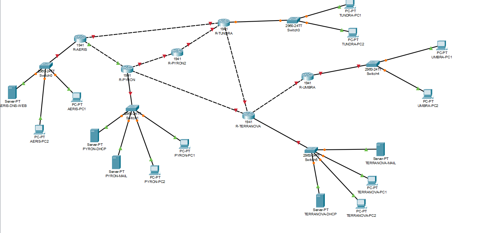

# Four Nations Communication Alliance – Network Design & Simulation

## Project Overview
This project was completed as part of my undergraduate Computer Networks
course at BRAC University. The objective was to design and configure a
multi-network communication system in Cisco Packet Tracer connecting five
networks with different addressing and routing requirements.

## Technologies and Concepts
- Cisco Packet Tracer
- IPv4 Addressing
- VLSM and Subnetting
- Static Routing
- RIPv2
- DHCP and DHCP Relay
- DNS
- Web and Email Services
- Redundant Routing
- Network Connectivity Testing

## Network Design

The network was designed using VLSM to allocate address space according to
the host requirements of each network.

### LAN Addressing

| Network | CIDR | Subnet Mask | Usable Hosts |
|---|---|---|---:|
| Aeris | 10.10.0.0/21 | 255.255.248.0 | 2046 |
| Terranova | 10.10.8.0/21 | 255.255.248.0 | 2046 |
| Pyron | 10.10.16.0/22 | 255.255.252.0 | 1022 |
| Tundra | 10.10.20.0/23 | 255.255.254.0 | 510 |
| Umbra | 10.10.22.0/26 | 255.255.255.192 | 62 |

WAN connections were configured using /30 subnets.

## Routing Configuration
The topology uses a combination of static routing and RIPv2 to provide
communication between the different networks.

The implementation also includes redundant and controlled routing paths
according to the requirements of the network.

## Network Services
The network includes configuration of:
- DHCP
- DHCP Relay
- DNS
- Web services
- Email services

## Connectivity Testing
Connectivity between the networks was tested in Cisco Packet Tracer to
verify that devices could communicate according to the designed routing
and addressing scheme.

## Network Topology

## What I Learned
Through this project, I gained practical experience in designing and
configuring an IP network, calculating VLSM subnets, configuring static
and dynamic routing, setting up network services, and troubleshooting
connectivity issues in Cisco Packet Tracer.

